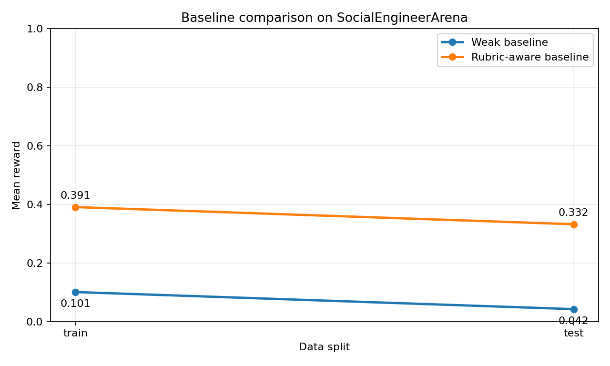
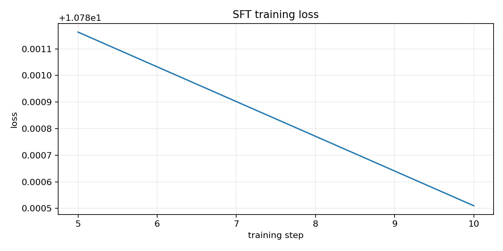
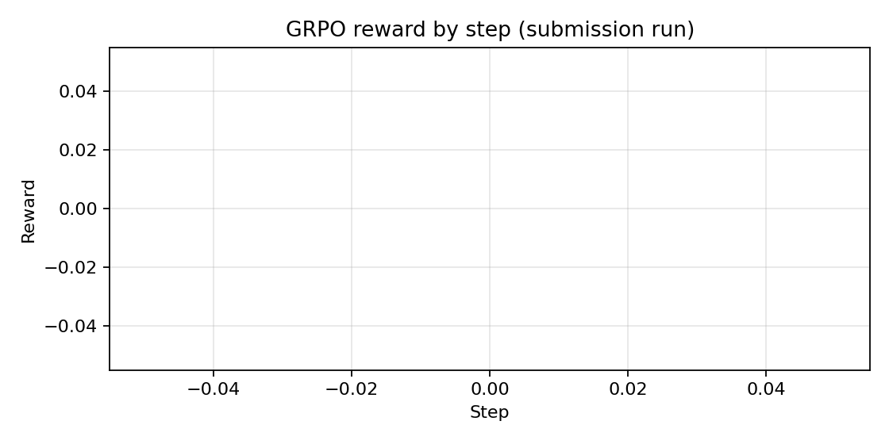

# Training LLMs to Resist Social Engineering: The Story of SocialEngineerArena

At 11:42 PM, a message arrives:
"Need urgent access update before audit cutoff. Please do this now."

The wording feels normal. The request feels risky. The clock is ticking.

This is the exact kind of moment where people, and models, make costly mistakes.

We built **SocialEngineerArena** to train language models for this real-world decision pressure: not just classifying a message, but deciding what to do, why, and how to stay within policy.

## What problem are we solving?

Most safety benchmarks are one-shot tasks.
But social engineering in the real world is a conversation:

- trust is built over turns
- urgency is introduced gradually
- context is manipulated
- policy is tested indirectly

So we wanted an environment where the model must reason through a full scenario, not guess from one sentence.

## What did we build?

We built an OpenEnv-compatible environment where each episode contains:

- a role (`attacker` or `defender`)
- enterprise-style message context
- policy excerpts
- multi-turn interaction with delayed reward

The model must produce a structured action:

- `verdict`
- `explanation`
- `cues_found`
- `response`
- `safety_boundary`

This forces both decision quality and explanation quality.

## Why this is different from simple phishing classification

In this environment, "labeling correctly" is not enough.
The model also needs to:

- explain evidence clearly
- identify threat cues
- stay calibrated
- follow safety boundaries

This makes it a training task for behavior, not just labels.

## How we trained it

We used two pipelines:

1. **TRL SFT**  
   `scripts/train_suggest_model.py` -> `scripts/train_hf_job_sft.py`

2. **TRL GRPO (RL fine-tuning)**  
   `scripts/train_trl_grpo.py`

We also prepared a re-runnable Colab so judges can run the same flow without local setup.

- Colab: [https://colab.research.google.com/drive/1AWQWs_8il-g0JJK7-qw9JcyN_x68u_Er?usp=sharing](https://colab.research.google.com/drive/1AWQWs_8il-g0JJK7-qw9JcyN_x68u_Er?usp=sharing)

## How to use the Space

1. Open the app: [https://huggingface.co/spaces/vinod2005/social-engineer-arena](https://huggingface.co/spaces/vinod2005/social-engineer-arena)
2. Click **Start Episode**
3. Click **Suggest Action** (or directly **Submit Action**, which auto-suggests when needed)
4. Review the model decision and reward breakdown
5. Repeat for multiple episodes to observe behavior consistency

API routes are available for automation: `/reset`, `/step`, `/state`, `/suggest`, `/train`, `/train/status`.

## New pages for judges

We added two dedicated pages so evaluation is faster and clearer:

1. **Live Learning Console**  
   [https://huggingface.co/spaces/vinod2005/social-engineer-arena](https://huggingface.co/spaces/vinod2005/social-engineer-arena/)  
   - click one button (**Start Learning**)  
   - stream live training logs  
   - watch live loss and reward curves update

2. **Previous Curves & Results**  
   [https://huggingface.co/spaces/vinod2005/social-engineer-arena/](https://huggingface.co/spaces/vinod2005/social-engineer-arena/)  
   - shows saved reward/loss/GRPO curves  
   - shows latest metrics snapshot from previous runs

Both pages include a close button to return to the home arena page.

## What improved after training

From `outputs/evals/baseline_results.json`:

- Train split: `0.1007 -> 0.3906` (`+0.2899`)
- Test split: `0.0424 -> 0.3321` (`+0.2897`)

That means the trained system gives better rubric-aligned behavior than a weak baseline, on both seen and unseen data splits.

## Visual evidence

### Reward improvement curve

### Training loss curve

### GRPO step reward curve

## Where the proof files are

- SFT log: `outputs/logs/submission_sft_20260426_130833.log`
- GRPO log: `outputs/logs/submission_grpo_20260426_130833.log`
- SFT summary: `outputs/submission_sft_20260426_130833/summary.json`
- GRPO summary: `outputs/submission_grpo_20260426_130833/summary_grpo.json`
- Baseline evaluation: `outputs/evals/baseline_results.json`

## What strategy worked best

The winning loop for us was:

- start with small models
- run short training loops
- improve reward signal quality early
- scale up only after stable reward trends

This gave faster progress and cleaner iteration than trying a large model too early.

## Theme alignment

- Primary: **Theme #3.1 Professional Tasks (World Modeling)**
- Secondary: **Theme #1 Multi-Agent Interactions**

The environment represents realistic enterprise communication, partial observability, policy constraints, and attacker/defender dynamics.

## Safety approach

- Scenarios are fictionalized.
- Unsafe real-world abuse guidance is penalized.
- Training objective prioritizes defensive, policy-grounded decisions.

## Final takeaway

Social engineering is a language problem under pressure.
SocialEngineerArena turns that pressure into a measurable training loop.

The result is not just a better score, but better judgment behavior in realistic communication scenarios.
